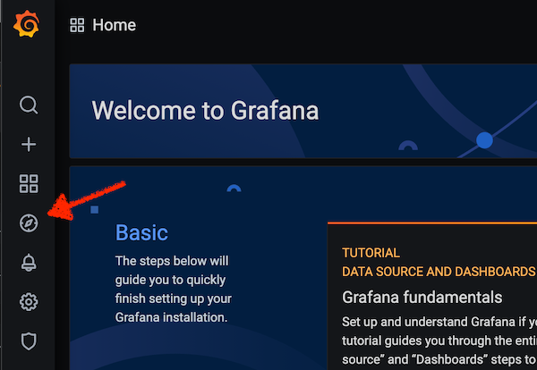
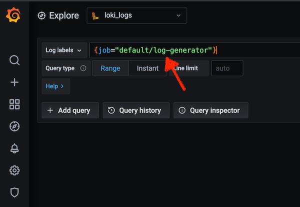
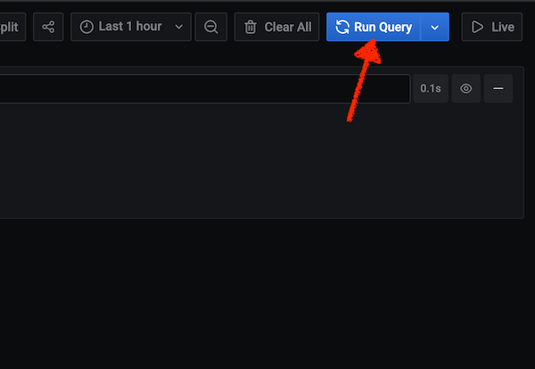
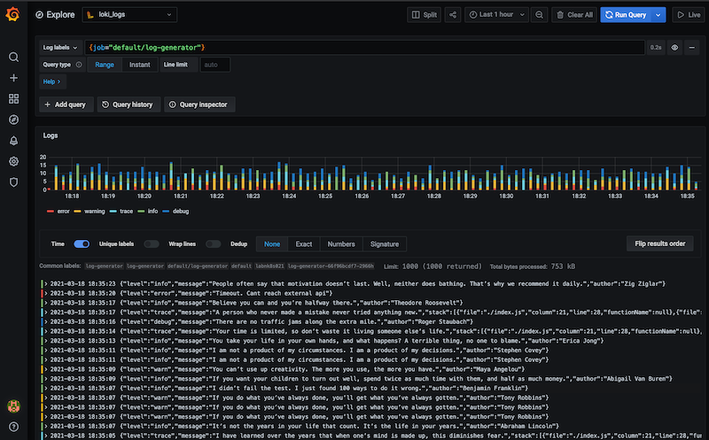

Getting started with Loki
-------------------------

There is a log-generator that can be rolled out to get started in the experimentation:

```bash
kubectl create deployment log-generator --image=presidenten/log-generator
```

- When until its up and running, then log into Grafana as user `admin` and use your secret password that you put in the `my-secret` file.

- Enter the `explore` section



- Enter a query the query to select log stream.
Working with the job label is a great way to filter streams.

- Try `{job="default/log-generator"}`, its in the form of `namespace/deployment`



- Then run the query to see the logs, press the Live button instead to follow the logs in near realtime.



- Congratulations! You now know the basics on how to select log streams in Grafana Loki.



- Try to click on all the buttons to figure out how to do default log type filtering, toggling timestamp etc

---

Some queries to try
-------------------

### Work with filters and parsers ###

- `{job="default/log-generator"}`
- `{job="default/log-generator"} |= "Timeout"`
- `{job="default/log-generator"} | json | message=~"Timeout.+"`
- `{job="default/log-generator"} | json | author=~".*(Proverb|Maya).*"`
- `{job="default/log-generator"} | json | author=~".+" | line_format "Author {{.author}}s fave color is {{.nested_color}}"`

### And some graphs###

#### Count log lines ####
- `sum by (job) (count_over_time({job="default/log-generator"} | json | level="error" [10m]))`


#### Work with numbers in the logs (notice the `unwrap duration`) ####
- `sum by (job) (quantile_over_time(0.99, {job="default/log-generator"} | json | message=~"Timeout.+" | unwrap duration [10m]))`
- `sum by (job) (quantile_over_time(0.95, {job="default/log-generator"} | json | message=~"Timeout.+" | unwrap duration [10m]))`
- `sum by (job) (avg_over_time({job="default/log-generator"} | json | message=~"Timeout.+" | unwrap duration [10m]))`

---
Further exploration
-------------------

Loki supports lots of filters and pipelines.

Grafana has nice docs on `LogQL`, but for a quicker start, checkout this cheat-sheet:

https://megamorf.gitlab.io/cheat-sheets/loki/


Full documentation:

https://grafana.com/docs/loki/latest/logql/
