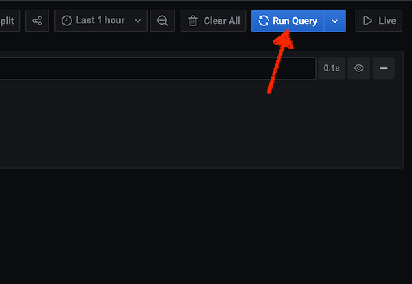

Getting started with Loki
-------------------------

There is a log-generator that can be rolled out to get started in the experimentation:

```bash
kubectl create deployment log-generator --image=presidenten/log-generator
```

When its up and running, log into Grafana with `admin` and your secret password in that you put in the `my-secret` file.

Enter the `explore` section


Enter a query the query to select log stream.
Working with the job label is a great way to filter streams.

Try `{job="default/log-generator"}`


Then run the query to see the logs, press the Live button instead to follow the logs in near realtime.



---

Exploring
---------

To find more things to do, checkout Grafanas pages on `LogQL`

